# Google Africa Developer Scholarship Phase II 

## Google Cloud Practice Project 

### Description
List of completed hands-on labs on Qwiklabs 

## Qwicklab Task: 

***Click on each lab with the arrow to view a drop-down of the completion verification screenshot.*** 

### Course: Google Cloud Platform Fundamentals - Core Infrastructure

 Module: Getting Started with Google Cloud Platform
 
 Lab 1 - GCP Fundamentals: Getting Started with Cloud Marketplace

 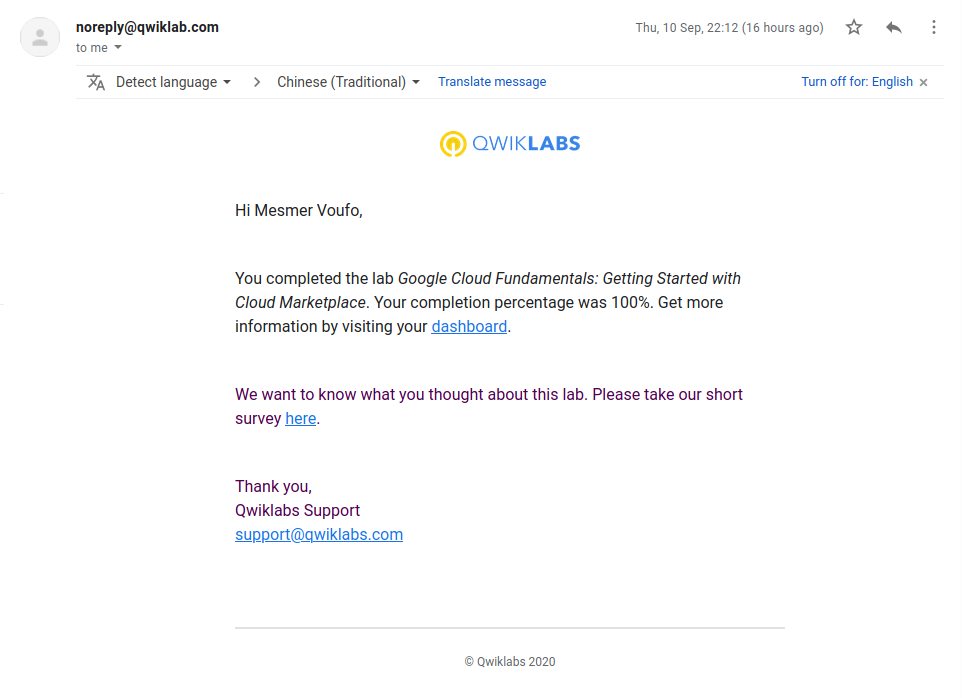

 Module: Virtual Machines in the Cloud
 
 Lab 2 - GCP Fundamentals: Getting Started with Compute Engine

 

 Module: Storage in the Cloud
 
 Lab 3 - GCP Fundamentals: Getting Started with Cloud Storage and Cloud SQL

 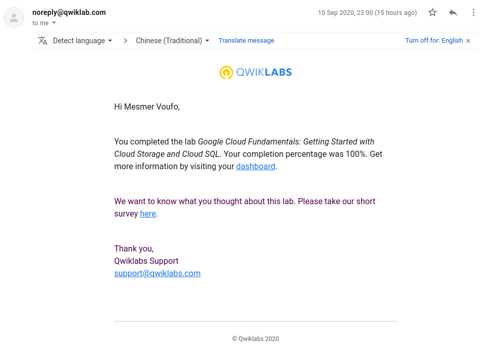

 Module: Containers in the Cloud
 
 Lab 4 - GCP Fundamentals: Getting Started with Kubernetes Engine

 

 Module: Applications in the Cloud
 
 Lab 5 - GCP Fundamentals: Getting Started with App Engine

 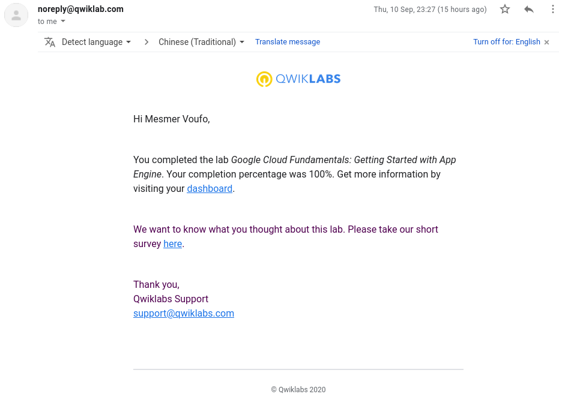

 Module: Developing, Deploying and Monitoring in the Cloud
 
 Lab 6 - GCP Fundamentals: Getting Started with Deployment Manager and Stackdriver

 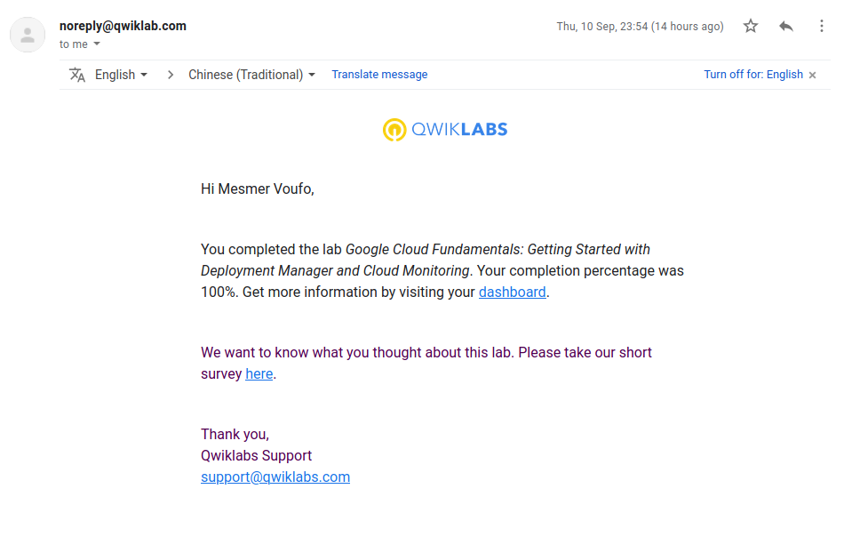

 Module: Big Data and Machine Learning in the Cloud
 
 Lab 7 - GCP Fundamentals: Getting Started with BigQuery

 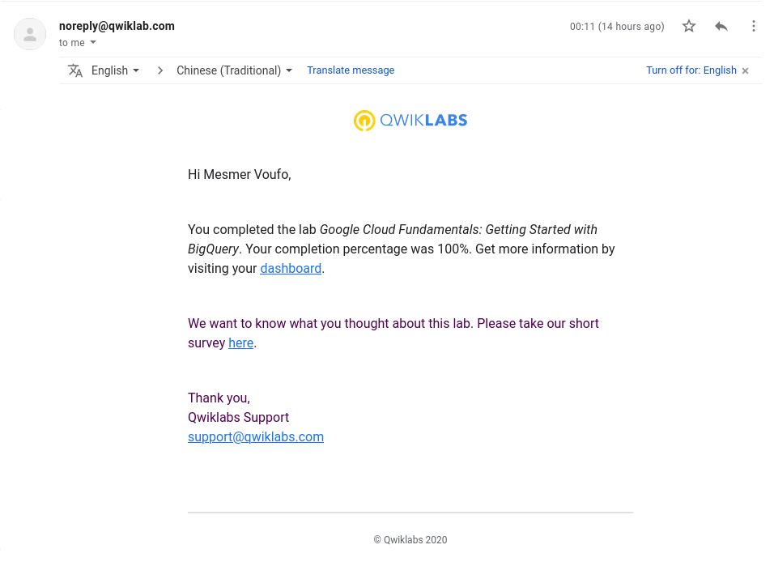

### Course: Essential Google Cloud Infrastructure: Foundation

 Module: Virtual Networks
 
 Lab 8 - Implement Private Google Access and Cloud NAT

 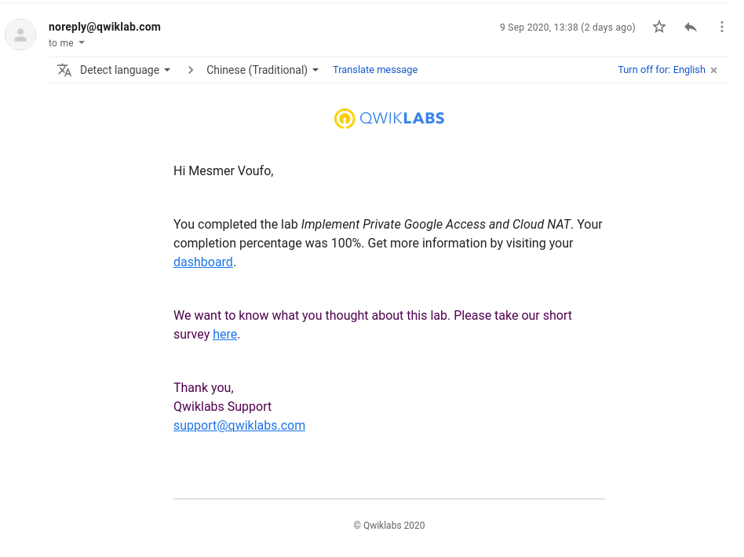

 Module: Virtual Machines
 
 Lab 9 - Creating Virtual Machines

 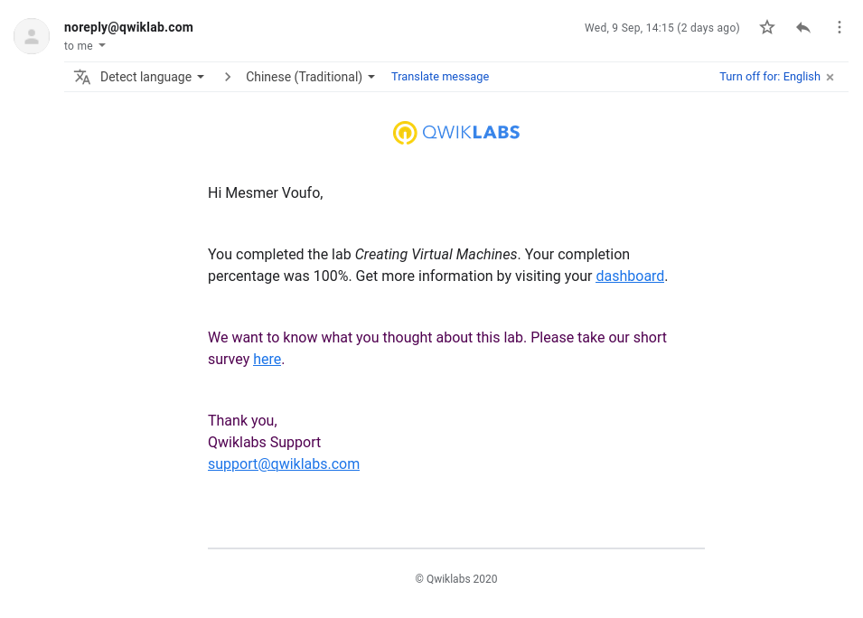

 Module: Virtual Machines
 
 Lab 10 - Working with Virtual Machines

 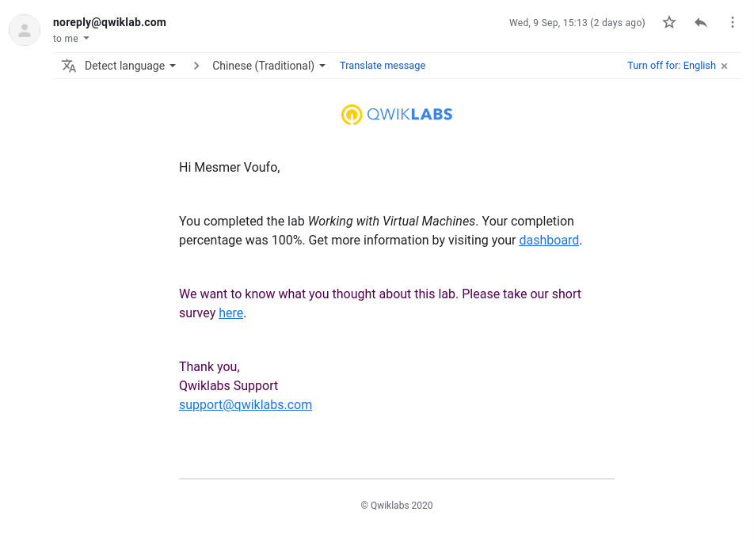

### Course: Essential Google Cloud Infrastructure: Core Services

 Module: Cloud IAM
 
 Lab 11 - Cloud IAM

 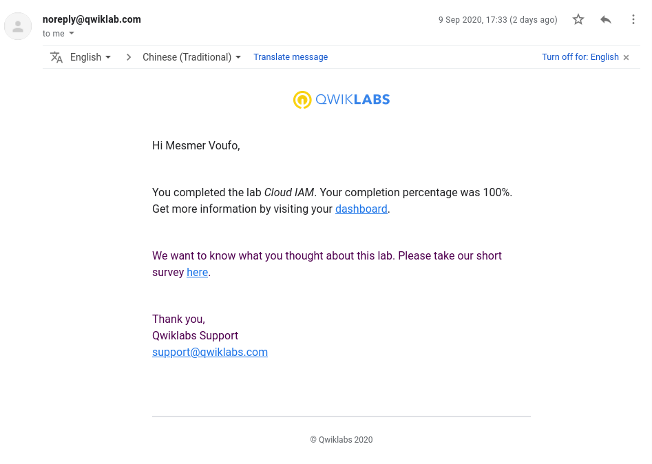

 Module: Resource Monitoring
 
 Lab 12 - Resource Monitoring

 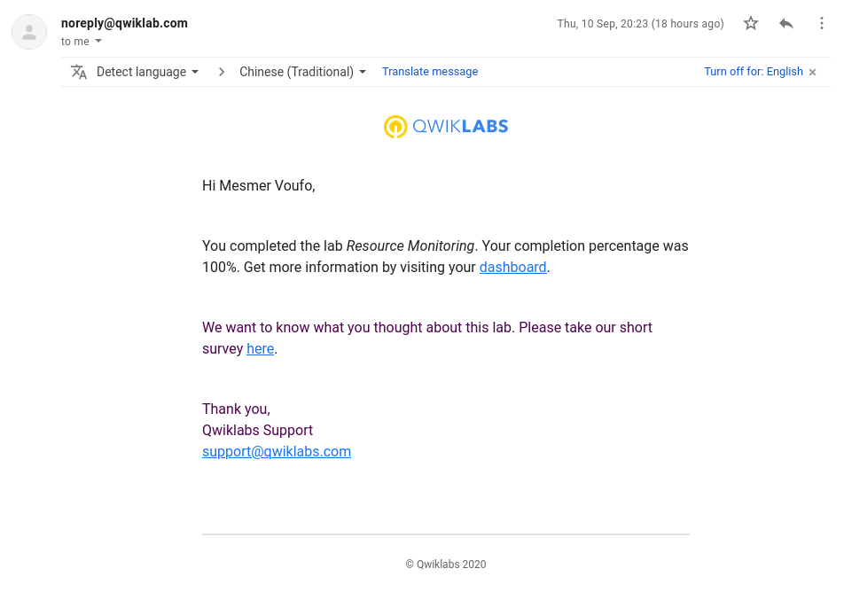

 Module: Resource Monitoring
 
 Lab 13 - Error Reporting and Debugging

 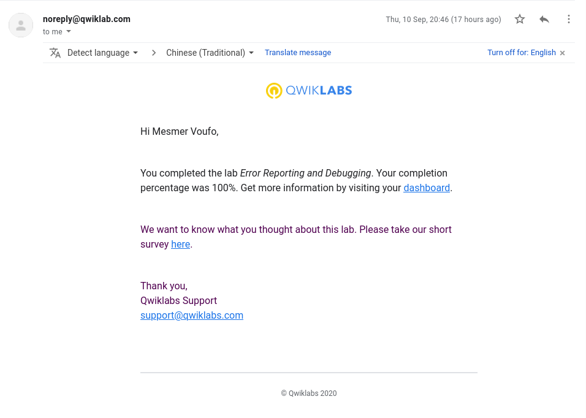

### Course: Elastic Google Cloud Infrastructure: Scaling and Automation

Module: Infrastructure Automation

 Lab 14 - Automating the Deployment of Infrastructure Using Deployment Manager

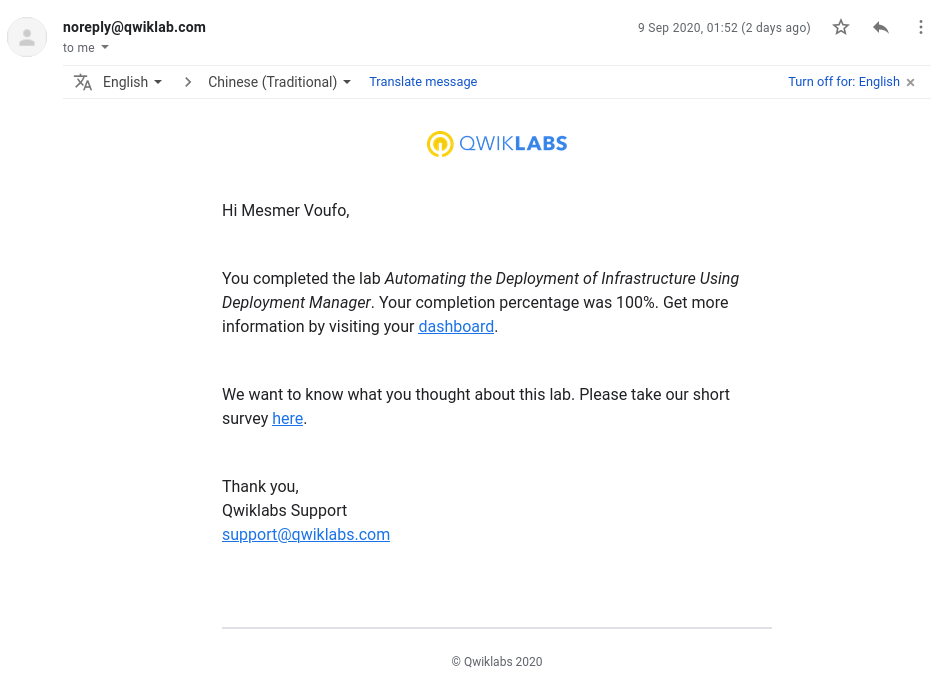

### Course: Getting Started with Google Kubernetes Engine

Module: Introduction to Containers and Docker

 Lab 15 - Introduction to Containers and Docker

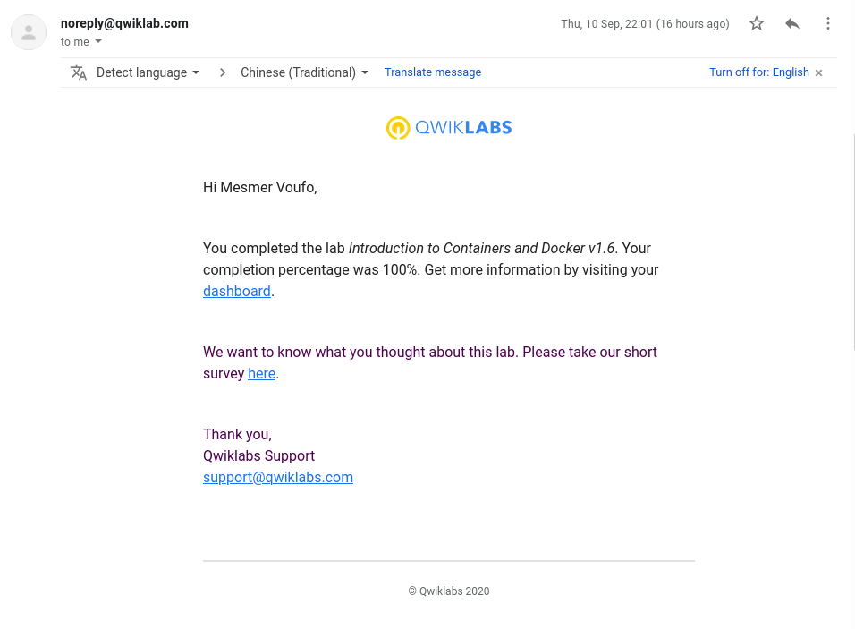

### Translations 

- [x] [Getting Started with App Engine](https://github.com/tsaffi/GCP-Project/translations/blob/master/AppEngine.md)

- [x] [Setting-up-a-Development-Environment-v1-1](https://github.com/tsaffi/GCP-Project/translations/blob/master/Setting-up-a-Development-Environment-v1-1.md)

- [x] [Getting Started with Compute Engine](https://github.com/tsaffi/GCP-Project/translations/blob/master/Getting-Started-with-Compute-Engine.md)

